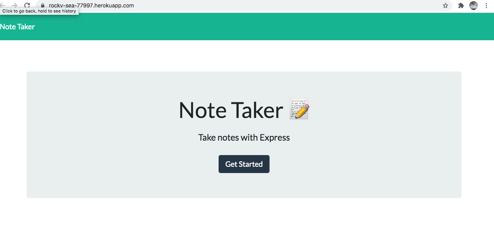

# hw11-mh-notetaker


## Description

Create an application that can be used to write, save. This application will use an express backend to save data and give access when requested
- [Link to Live Site](https://rocky-sea-77997.herokuapp.com/)


## User Story
* AS A small business owner
* I WANT to be able to write and save notes
* SO THAT I can organize my thoughts and keep track of tasks I need to complete

## Screenshot




```


## Usage
1. install npm init -y, npm install express --save
2. run node server.js
3. navigate to localhost:8080
4. Click "Get Started" on webpage
5. Create title and body for note and click save button


## Repository

  - [Project Repo](https://github.com/basedmilz/hw11-mh-notetaker)
